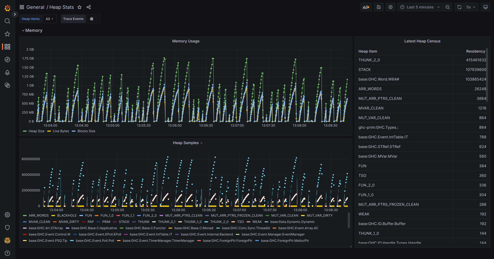
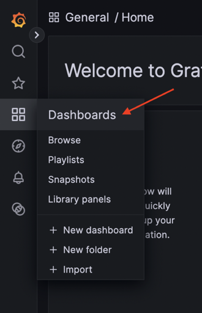

# `eventlog-live` Infrastructure

This repository contains a [Docker Compose][docs:docker-compose] configuration
that declares infrastructure for simple, real-time monitoring of Haskell
programs via [`ghc-eventlog-socket`][ghc-eventlog-socket] and
[`eventlog-live`][eventlog-live]. The infrastructure includes an
[InfluxDB][docs:influxdb] database that contains metrics from the eventlog, and
a [Grafana][docs:grafana] instance that offers interactive visualizations of the
eventlog metrics. To use it, simply instrument your application, set an
environment variable, and `docker compose up`.



## Example

The [`./example`](./example/) directory contains a minimal example of an
application that is compatible with this infrastructure. See its
[`README.md`](./example/README.md) to try it out.

## Get Started

### Dependency

First, add [`ghc-eventlog-socket`][ghc-eventlog-socket] as a dependency. It is
not on Hackage, so use a `source-repository-package` in your `cabal.project`
file:

```cabal
source-repository-package
  type: git
  location: https://github.com/FinleyMcIlwaine/ghc-eventlog-socket
  tag: e8cbc1a554d5146d4d0142e700be8ae3850e8d6a
```

Then, in your `.cabal` file, add `eventlog-socket` to `build-depends`:

```cabal
executable my-exe
  ...
  build-depends:
    ...
    eventlog-socket,
    ...
```

### Instrumentation

Now, instrument your application to allow the eventlog to be streamed from a
socket using the `GHC.Eventlog.Socket.start` function. The function takes the
desired socket path as an argument.

```haskell
module Main where

import qualified GHC.Eventlog.Socket

main :: IO ()
main = do
    ...
    putStrLn "creating eventlog socket"
    GHC.Eventlog.Socket.start "/path/to/socket"
    ...
```

Your application is now ready to be profiled using this infrastructure.

### Profiling

Compile your application with the `-eventlog` GHC option to enable eventlog
emission (and perhaps `-rtsopts` if you wish to supply heap profiling RTS
options). Run your application with flags `+RTS -l --eventlog-flush-interval=1`
to enable the eventlog and make the RTS flush the events queue every second.

Set the `GHC_EVENTLOG_SOCKET` environment variable to the path of the socket
created by your instrumented application.

Lastly, just `docker compose up`. You should be able to navigate to the Grafana
instance at `localhost:3000`. Use username and password `admin` and `admin`.

The InfluxDB datasource is already configured in the Grafana instance, so you
can now start making your own dashboards. There is also already an example
dashboard in the instance. To view it, select "Dashboards" in the navigation
pane:



Under "General", select "Heap Stats", and you will see a dashboard like the one
at the top of this document.


[docs:docker-compose]: https://docs.docker.com/compose/
[docs:influxdb]: https://www.influxdata.com/
[docs:grafana]: https://grafana.com/

[eventlog-live]: https://github.com/mpickering/eventlog-live
[ghc-eventlog-socket]: https://github.com/bgamari/ghc-eventlog-socket